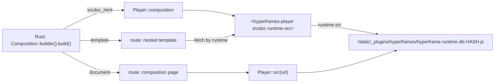

# ADR 0001: HyperFrames plugin design

- Status: accepted
- Date: 2026-10-08
- Applies to: autumn-plugin-hyperframes 0.1.0, autumn-web 0.8.0, HyperFrames 0.8.140

## Context

HyperFrames compositions are HTML documents with timed clips. The
`<hyperframes-player>` element plays them in a sandboxed iframe. By default the
player loads the runtime from `cdn.jsdelivr.net`. Autumn sends
`script-src 'self'`, `frame-ancestors 'none'` and `X-Frame-Options: DENY`.
So the CDN script is blocked, and a composition page from the same app cannot
load in the player iframe.

## Decision

1. Vendor the player IIFE and the runtime IIFE without changes. Serve them with
   the other plugin files as one `PluginAssets` bundle (`hyperframes`).
2. Every `Player` sets `runtime-src` to the vendored runtime URL. The player
   accepts a same-origin `runtime-src` and puts it into a `srcdoc` page.
3. The default embed is `srcdoc` (`Player::composition`). A `srcdoc` frame is not
   a navigation, so frame headers do not apply. Its HTML has no runtime tag, so
   the runtime loads one time.
4. `document()` links the runtime with SRI for pages that the app serves
   (`Player::src`, the HyperFrames CLI).
5. Type state: `CompositionBuilder::build()` checks all rules and returns all
   errors. Only a checked `Composition` renders.
6. Clip kinds are type parameters (`Clip<Video>`). Setters exist only where they apply.
7. No inline scripts in the builder. CSS animations in stylesheets give motion;
   the runtime seeks them.
8. `init.js` adds what the player does not have: control buttons, in-view play,
   reduced motion and htmx cleanup.

## Consequences

- Works with the default Autumn CSP and headers. The e2e tests prove it.
- `src` mode needs `frame-ancestors 'self'` and `X-Frame-Options: SAMEORIGIN`.
- The runtime adds `<style>` elements. A `style-src` without `'unsafe-inline'` blocks them and logs a CSP error; timing and sizing still work.
- The root has no `style` attribute. The runtime sizes it from `data-width` and `data-height`.
- The runtime is 507 KB. Only composition frames load it, not the host page.
- A HyperFrames upgrade is a plugin release: replace the files, update the pins.
